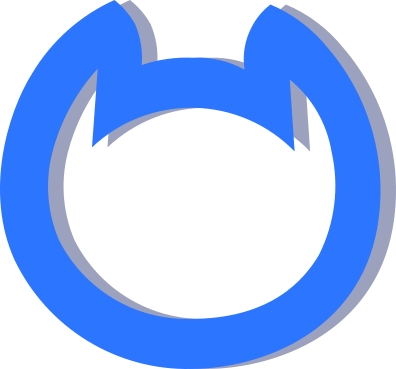

<h1 align="center">Hi 👋, I'm Varnit</h1>
<h3 align="center">A passionate frontend developer from India</h3>

  

## Competitions: 🥇

### CTF's

| CTF | Result | Team | Date |
|-----|-----|-----|-----|
|CIT@CTF|top 6%|undermouses|04/2024|
|BSidesSF CTF|top 10%|movie43|05/2024|
|swampCTF|top 17%|check_your_mouse |03/2024|
|vksCTF|top 18%| Solo played |09/2023|
|Space HeroesCTF| top 23% | check_yor_mom |04/2024|
|AI CTF|top 23%|movie43|05/2024|
|BCACTF 5.0|top 25%|movie43|06/2024|
|wolvCTF|top 31%| undermouses|03/2024|
|osuCTF|top 35%| undermouses |02/2024|
|ethernautCTF|out of competition|solo|03/2024|

### Algorithms [LeetCode](https://leetcode.com/Varnit21/)

- 🔭 I’m currently researching at the intersection of machine learning and databases with the [IDEA Lab](http://web.engr.oregonstate.edu/~termehca/)
- 💬 Brainstorm with me over tech, algorithms, career, and music 
- 📫 How to reach me: varnitbr21@gmail.com
- 😄 Pronouns: Programmer/He/His/Him

<h3 align="left">Connect with me:</h3>

### Languages:
| Python3 | C | JS | Solidity | GO |
|----------|----------|----------|-----|-----|
|   |   |   |  |  | 

  

### Best frameworks and main libraries for Python3:

| Pytorch | Selenium | Numpy | Pandas | Sklearn | Matplotlib | OpenCV |
|----------|----------|----------|----------|----------|----------|----------|
|  |  |  |  |  |  | |

### My tools for Data Manipulation:

| Conda | Jupyter | Spark | MySQL | Postgres | SQLite |
|----------|----------|----------|----------|----------|----------|
|||||||

  
### Environments, Testing, Other:

| nodejs | Git | Docker | Pytest | Swagger | Postman | Virtual Box| HardHat |
|----------|----------|----------|----------|----------|----------|----------|----------|
|||||  |  || |

### OS: ❤️

| Windows 11 | Ubuntu | Kali |
|----------|----------|----------|
|  |  |  |

### Tools for CTF's
 
| Metasploit | Wireshark | Burpsuite | Netcat | Nmap |
|----------|----------|----------|----------|----------|
||||||

---

  

  

---

  
  

 

<!--

  

 

<!--
### How to reach me :mailbox:

--> 
I am AI
